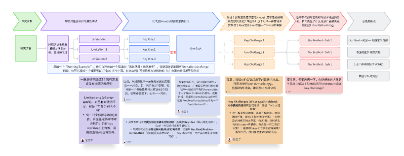

# 3.3 论文写作 - 技术类Full Paper思考模板（讨论用）

## 使用说明

在（idea brainstorming、进展、写作阶段）讨论论文项目，可以用这个模板里面的表格，把你的论文思路实例化之后，方便讨论。

**如何用？** 你可以创建该文档的副本，然后在你自己的副本中填写具体的内容。

## 论文Introduction写作的思考模型（Introduction是整个论文的精简版）

一般来说，Introduction 可以看作整篇论文的"压缩版"：用最少的篇幅把研究对象讲清楚，把问题为什么难讲透，再把我们的方法为什么必要讲明白。一个清晰的写作组织是：先用一个典型应用场景/运行例子引出研究背景与需求；随后对现有代表性工作进行归纳，提炼其在关键假设、数据特性、工作负载与系统约束下暴露的主要局限（通常不超过3点）；在此基础上进一步刻画该问题的本质属性与硬约束（例如规模、动态性、异构性、端到端开销、正确性/一致性要求等），从而自然导出本文要解决的研究目标或问题定义（Our Goal / Problem Formulation），或支撑方案设计的核心洞见（Key Idea）。接着，需要明确实现该目标所面临的关键挑战（通常不超过3点），解释为何直接套用或简单扩展已有方法难以奏效。最后给出与挑战一一对应的方法总览（整体框架与关键模块），并以贡献点收束：包括问题定义/设定（若有）、系统/框架设计、1-2个关键技术点以及充分的实验评估与分析。

### Introduction 写作/构思的 Flowchart

### 快速定位：这篇论文是什么类型？

**Technique paper（新方法解决既有问题）**
- 主轴：Key Idea / Mechanism
- Goal：一句话交代即可

**Propose a New Research Problem/Setting（新问题/新设定/新任务）**
- 主轴：Our Goal / Problem Formulation（问题定义本身是贡献）
- Key Idea：作为"为什么这样定义合理/可行"的支撑

## 思考模板

请同学们结合你当前的研究题目，把下面表格进行实例化。最后一节有参考资源，我对若干论文使用这个思考模板进行案例分析，大家可以参考学习。

| 逻辑阶段 | 内容 |
|---------|------|
| **研究背景** | 研究场景是什么？为什么重要？需要一个清晰的场景定义 + 研究动机 |
| **研究问题分析与属性解读** | 对现状或者现有最新方法的分析，总结局限性。一般总结不超过3个现有方法或现有问题的局限性。 |
| | Limitation 1 |
| | Limitation 2 |
| | Limitation 3 |
| **论文的Novelty和创新思路讨论** | 注意，创新思路不一定是和前述的局限性一一对应。即，我们有3个局限，也可用一个创新思路可以解决这3个挑战。在某些情况下，也可一一对应。 |
| | Key Idea（一般创新思路不会很多，常见是1~2个）：如果你的论文是提出**新方法解决已知问题**，主轴用 Key Idea（核心洞见/机制），Goal 一句话交代或者不提也行。如果你的论文是提出**新问题/新设定/新任务**，主轴用 Our Goal/Problem Formulation（把问题定义成贡献之一），Key Idea 作为"为什么这样定义合理/可行"。 |
| **你这个创新思路是不是很Naive？是不是拍脑袋就能想到或者实现出来？这个时候一般要讲实现这个Idea或者Goal不是一个trivial的事情** | 注意，投稿AI的会议经常不讨论技术挑战，而是直接讲Our Methodology。如果讲，则一般可以从以下角度思考：例如搜索空间爆炸、系统开销受限、端到端闭环难、理论/工程约束冲突等。一般就是讲搜索空间大导致效率慢；同时优化A和B的trade-off很难，有没有一石二鸟的方案？直接用naive的方案实现准确率/效果不行，我们需要更smart的方法。 |
| **基于我们创新思路和对技术挑战的分析，我们提出了什么方法？去解决这些挑战？Our Methodology** | |
| | 总领句 |
| | 第一个技术点 |
| | 第二个技术点 |
| | 第三个技术点 |
| **总结贡献点** | 常规性总结。 |

## 参考资源

- [ICML 2025 - Alpha-SQL 写作思路剖析](../06_Case_Studies/6.1_ICML_2025_Alpha-SQL写作剖析.md)
- [ICLR 2025 - AFlow 写作思路剖析](../06_Case_Studies/6.2_ICLR_2025_AFlow写作剖析.md)
- [VLDB 2026 - LEAD 写作思路剖析](../06_Case_Studies/6.3_VLDB_2026_LEAD写作剖析.md)
